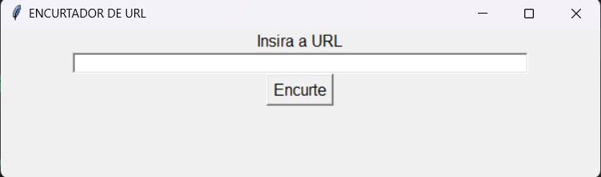
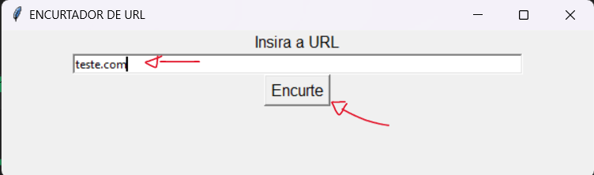
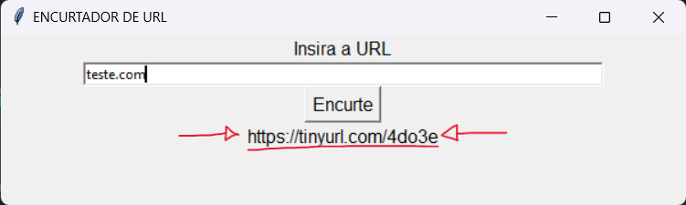

# Encurtador de URL 🌐 

## 📒 Descrição
Este programa pega um URL original e encurta seu tamanho para facilitar o compartilhamento.

## 🤖 Tecnologias Utilizadas
- 
    - ***pyshorteners*** -  Biblioteca usada para encurtar um URL passado pelo usuário;

    - ***tkinter*** - Biblioteca usada para criar um interface para o usuário.

## 🤔 Como usar?
 > Step 1 - Abra o  arquivo app.py e rode o código; 

 > Step 2 - Após abrir a janela do programa, coloque o link que você deseja encurtar no local indicado;

 > Step 3 - Aperte encurtar;

 > Step 4 - Pronto!!! O novo link será gerado. Basta copiar e armazenar o link gerado;
 

## Licença

Copyright © 2024 Saulo Gil

Permission is hereby granted, free of charge, to any person obtaining a copy of this software and associated documentation files (the “Software”), to deal in the Software without restriction, including without limitation the rights to use, copy, modify, merge, publish, distribute, sublicense, and/or sell copies of the Software, and to permit persons to whom the Software is furnished to do so, subject to the following conditions:

The above copyright notice and this permission notice shall be included in all copies or substantial portions of the Software.

THE SOFTWARE IS PROVIDED “AS IS”, WITHOUT WARRANTY OF ANY KIND, EXPRESS OR IMPLIED, INCLUDING BUT NOT LIMITED TO THE WARRANTIES OF MERCHANTABILITY, FITNESS FOR A PARTICULAR PURPOSE AND NONINFRINGEMENT. IN NO EVENT SHALL THE AUTHORS OR COPYRIGHT HOLDERS BE LIABLE FOR ANY CLAIM, DAMAGES OR OTHER LIABILITY, WHETHER IN AN ACTION OF CONTRACT, TORT OR OTHERWISE, ARISING FROM, OUT OF OR IN CONNECTION WITH THE SOFTWARE OR THE USE OR OTHER DEALINGS IN THE SOFTWARE.

#

👨‍💻 Feito por Saulo Gil.